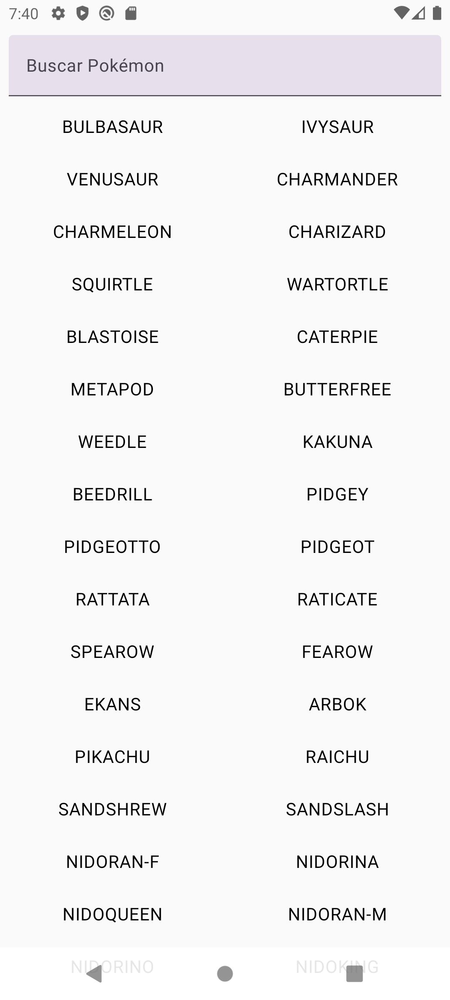
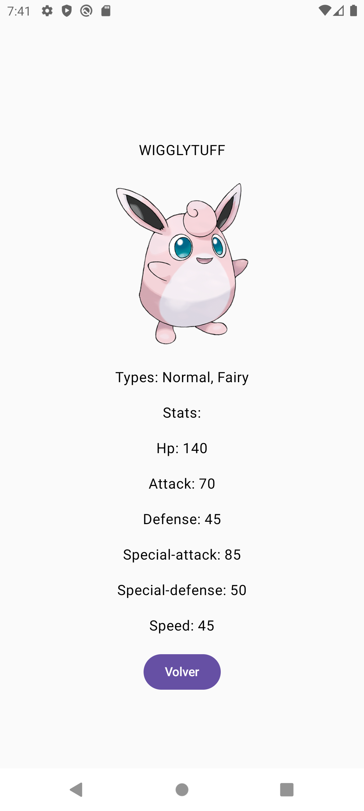

# PokéAPI Android

📚 DAM – Programación Multimedia y Dispositivos Móviles (PMDM)  
✍️ Entrega - App Android en **Kotlin** que consume la **PokéAPI** para mostrar Pokémon con Jetpack Compose.

## 🛠️ Tecnologías

## ⚙️ Funcionalidad
- **Lista de Pokémon** obtenida desde la PokéAPI con filtro de búsqueda.  
- **Pantalla de detalles** con sprite oficial, tipos y estadísticas.  
- Carga dinámica de imágenes mediante **Coil**.  
- Consumo de API REST con **Retrofit + Gson**.  

## 📸 Vista previa
Pantalla de lista y detalles en la app:

   
